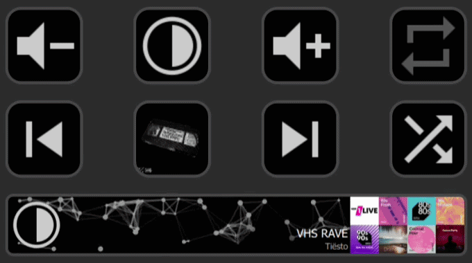
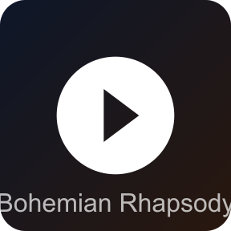
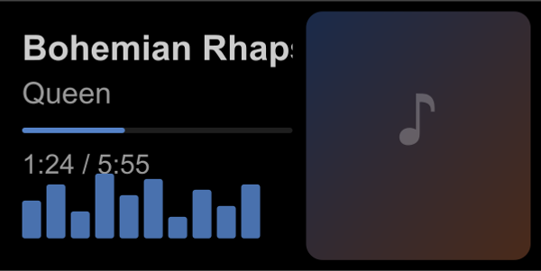
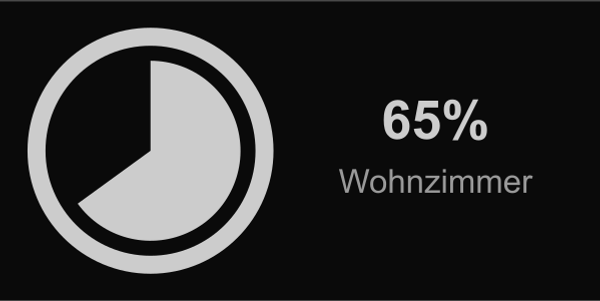
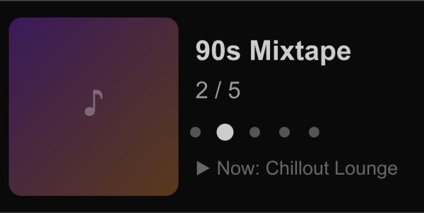
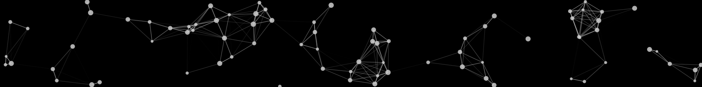
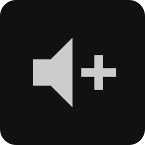
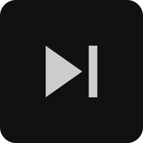
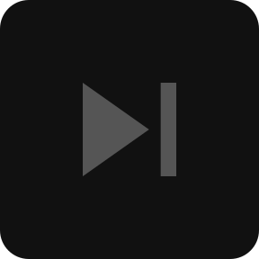

# Sonos Controller for Elgato Stream Deck

Full Sonos playback control for your Stream Deck — cover art, track info, volume dials, favorites browsing, and ambient particle animations.

> **Disclaimer:** This is an independent, community-made plugin. It is not affiliated with, endorsed by, or officially connected to Sonos, Inc. or Elgato in any way. Sonos is a trademark of Sonos, Inc.

---

## At a Glance

| Key Actions | Dial Actions *(Stream Deck+ only)* |
|---|---|
| **Play / Pause** — cover art + scrolling title | **Track Dial** — cover art · title · progress · EQ Effect |
| **Playback Control** — next · previous · shuffle · repeat | **Volume Dial** — pie chart · mute · preset |
| **Volume Key** — up · down · mute · preset | **Favorites Dial** — browse & play your favorites list |
| **Play Favorite** — one tap to play a saved favorite | **Panorama Particles** — ambient art spanning multiple panels |

---

## Actions

### Play / Pause Key

Toggles playback on your Sonos speaker. While playing, the key displays the current album or radio station cover art. A scrolling marquee shows track title and artist.

| Setting | Description |
|---------|-------------|
| Device | Which Sonos speaker to control |
| Show cover art | Display album art on the key while playing |
| Show track title | Scroll the track title and artist across the key |
| Font color | Color for the scrolling title text |
| Font size | Size of the title text (px) |

---

### Track Dial *(Stream Deck+ only)*

The centerpiece of the plugin. The LCD panel shows the album or station cover art, a scrolling track title, artist name, and a progress bar — tinted to match the cover art palette.

| Interaction | Effect |
|-------------|--------|
| Rotate | Seek ±5% in the current track |
| Press | Skip to next track |
| Touch | Toggle play / pause |

| Setting | Description |
|---------|-------------|
| Device | Which Sonos speaker to control |
| Background | `None` (track info only), `EQ Effect` (animated bars), or `Particles` |
| Particle count | Number of particles (Particles mode) |
| Particle speed | Animation speed (Particles mode) |

---

### Volume Dial *(Stream Deck+ only)*

Dedicated volume control with a live pie chart showing the current level. When muted, a volume-off icon replaces the pie.

| Interaction | Effect |
|-------------|--------|
| Rotate | Adjust volume (±1% per tick, ±2% for fast rotation) |
| Press | Toggle mute |
| Touch | Set volume to configured preset |

| Setting | Description |
|---------|-------------|
| Device | Which Sonos speaker to control |
| Preset Volume | Target volume for touch |
| Alignment | Position of the pie: `Left`, `Center`, or `Right` |
| Background | `None` or `Particles` |

---

### Favorites Dial *(Stream Deck+ only)*

Browse and play your saved Sonos favorites. Rotate to scroll through the list; the LCD shows the cover art, title, and position indicator for the highlighted item.

| Interaction | Effect |
|-------------|--------|
| Rotate | Scroll through favorites |
| Press | Play the highlighted favorite |
| Touch | Return to now playing |

| Setting | Description |
|---------|-------------|
| Device | Which Sonos speaker to control |
| Browse timeout | Seconds of inactivity before returning to now playing |

---

### Panorama Particles Dial *(Stream Deck+ only)*

Ambient particle network animation that spans multiple adjacent LCD panels as one continuous scene. Place two or more side by side to connect them into a seamless panorama.

| Interaction | Effect |
|-------------|--------|
| Rotate | Adjust particle count or speed (depending on active mode) |
| Press | Toggle between count mode and speed mode |

---

### Volume Key

Increase, decrease, mute, or set a preset volume with a single key press.

| Setting | Description |
|---------|-------------|
| Device | Which Sonos speaker to control |
| Command | `Volume Up`, `Volume Down`, `Mute / Preset`, or `Volume Preset` |
| Preset Volume | Target volume for the preset command |
| Show preset | Display the preset value on the key |

---

### Playback Control Key

Next, previous, shuffle, or repeat — each as a dedicated key. All four **dim automatically** when a radio station is playing, since seek controls are unavailable for live streams.

| Setting | Description |
|---------|-------------|
| Device | Which Sonos speaker to control |
| Command | `Next Track`, `Previous Track`, `Toggle Shuffle`, or `Toggle Repeat` |

---

### Play Favorite

Play one of your saved Sonos favorites with a single key press. The key displays the favorite's cover art while it is playing.

| Setting | Description |
|---------|-------------|
| Device | Which Sonos speaker to control |
| Favorite | Select from your Sonos favorites list |
| Show title | Display the favorite's title on the key |

---

## Requirements

- **Elgato Stream Deck** — any model for key actions; **Stream Deck+** required for dial actions
- **Stream Deck software** — version 6.9 or later
- **Sonos system** — any Sonos speaker on the same local network as your computer
- **Network** — plugin and speaker must be on the same subnet (no VLAN isolation between them)

---

## Setup

1. Install the plugin via the **Elgato Marketplace** or by double-clicking the `.streamDeckPlugin` file.
2. Drag an action from the **Sonos Controller** category onto a key or dial slot.
3. Open the action's settings (click the slot in Stream Deck software).
4. Select your **Sonos device** from the dropdown — devices are discovered automatically on your local network.
5. Configure the remaining options and click anywhere to save.

> The plugin supports **English**, **German**, and **Spanish** in the settings panel — the language follows your operating system's regional setting.

---

## Troubleshooting

**Speaker not showing in the device list**
- Make sure the speaker is powered on and connected to your Wi-Fi or Ethernet.
- The computer and speaker must be on the **same subnet**. The plugin uses UPnP, which does not cross router or VLAN boundaries.
- Restart the Stream Deck software and wait a few seconds for discovery to complete.

**Cover art not showing on radio stations**
- Radio station art is fetched on first play. It may take a moment to appear after the plugin starts.

**Controls not responding / out of sync**
- The plugin uses UPnP event subscriptions for real-time updates. On an unstable network, a subscription may drop and recover automatically within 60 seconds.
- If the problem persists, restart the Stream Deck software.

**Panorama Particles not connecting across panels**
- All Panorama Particles dials must be placed in **adjacent slots** in the same profile row.
- Each dial detects its neighbors automatically — no manual column setting is needed.

---

## Network Notes

- The plugin subscribes to **UPnP events** from each Sonos device for real-time track and volume updates.
- Subscriptions are automatically renewed to maintain the connection.
- **No cloud connection** — the plugin only communicates with Sonos devices on your local network.

---

## License

MIT — see [LICENSE](LICENSE)

---

## Credits

Built with:
- [Elgato Stream Deck SDK](https://developer.elgato.com/documentation/stream-deck/) (`@elgato/streamdeck`)
- [Sonos TypeScript SDK](https://github.com/svrooij/node-sonos-ts) (`@svrooij/sonos`) by Stephan van Rooij — MIT license
- [Material Design Icons](https://pictogrammers.com/library/mdi/) (`@mdi/js`) — MIT license
- [sdpi-components](https://github.com/geekyeggo/sdpi-components) by GeekyEggo — MIT license
