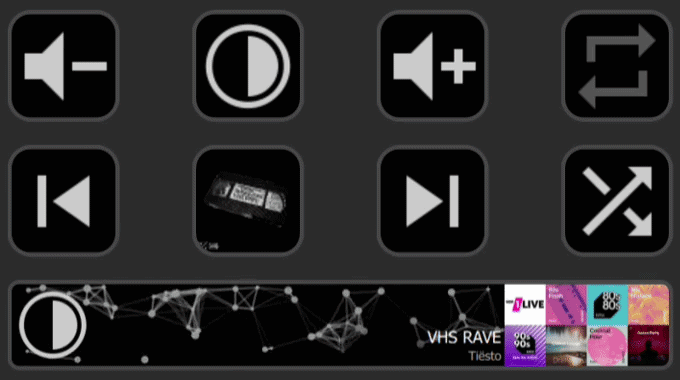
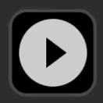
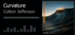
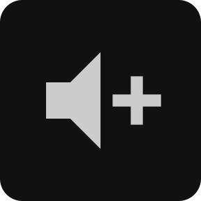
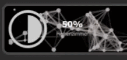
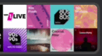
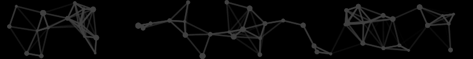

# Sonos Controller for Elgato Stream Deck

Full Sonos playback control for your Stream Deck — cover art, track info, volume dials, favorites browsing, and ambient panorama effects.

> **Disclaimer:** This is an independent, community-made plugin. It is not affiliated with, endorsed by, or officially connected to Sonos, Inc. or Elgato in any way. Sonos is a trademark of Sonos, Inc.

---

## At a Glance

| Key Actions | Dial Actions *(Stream Deck+ only)* |
|---|---|
| [**Play / Pause**](#play--pause) — cover art · scrolling title · progress | [**Track Control**](#track-control-stream-deck-only) — cover art · title · progress · EQ Effect |
| [**Playback Control**](#playback-control) — next · previous · shuffle · repeat | [**Queue**](#queue-stream-deck-only) — browse & jump within the current queue |
| [**Volume Control**](#volume-control) — up · down · mute · preset | [**Volume**](#volume-stream-deck-only) — pie chart · mute · preset |
| [**Play Favorite**](#play-favorite) — one tap to play a saved favorite | [**Group Volume**](#group-volume-stream-deck-only) — control a whole Sonos group's volume together |
| [**Multi-Control**](#multi-control) — Line-In switching (optional fade) or a live Battery display | [**Favorites**](#favorites-stream-deck-only) — browse & play your favorites list · cover mosaic or effect + heart icon |
| | [**Panorama Effects**](#panorama-effects-stream-deck-only) — ambient art spanning multiple panels |

---

## Actions

### Play / Pause

Toggles playback on your Sonos speaker. While playing, the key displays the current album or radio station cover art. A scrolling marquee shows track title and artist. Works correctly for a speaker that's grouped with others, following the group's actual playback rather than the joined speaker's own idle state.

| Setting | Description |
|---------|-------------|
| Device | Which Sonos speaker to control |
| Show device name | Display the speaker's zone name as the key title |
| Show cover art | Display album art on the key while playing |
| Progress bar | Thin bar at the bottom of the key showing track position, tinted to the cover's dominant color |
| Show track title | Scroll the track title and artist across the key |
| Font color | Color for the scrolling title text |
| Font size | Size of the title text (px) |
| Battery | `Off`, `Warning` (icon only when the battery is low), or `Always` — mini battery icon for battery-powered speakers (Sonos Roam, Move). Only shown when the selected device actually reports battery data. |

---

### Track Control *(Stream Deck+ only)*

The LCD panel shows the album or station cover art, a scrolling track title, artist name, and a progress bar — tinted to match the cover art palette. If the selected speaker is grouped with others, it correctly reflects the whole group's playback (cover, title, play/pause state) rather than the joined speaker's own idle state.

Also handy for quickly auditioning a playlist: rotate to scrub within the current track, press to jump to the next one.

| Interaction | Effect |
|-------------|--------|
| Rotate | Seek ±5% in the current track |
| Press | Skip to next track |
| Touch | Toggle play / pause |

| Setting | Description |
|---------|-------------|
| Device | Which Sonos speaker to control |
| Background | `None` (track info only), `EQ Effect` (animated bars), or any Panorama effect |
| Battery | `Off`, `Warning` (icon only when the battery is low), or `Always` — mini battery icon in the corner for battery-powered speakers (Sonos Roam, Move). Only shown when the selected device actually reports battery data. |

---

### Playback Control

Next, previous, shuffle, or repeat — each as a dedicated key. All four **dim automatically** when a radio station is playing, since seek controls are unavailable for live streams.

 

| Setting | Description |
|---------|-------------|
| Device | Which Sonos speaker to control |
| Command | `Next Track`, `Previous Track`, `Toggle Shuffle`, or `Toggle Repeat` |

---

### Queue *(Stream Deck+ only)*

Browse and jump within the currently playing queue without interrupting playback. Rotate to preview upcoming or previous tracks — the LCD shows the previewed title with its neighbors above and below; press to jump playback there, touch or wait to cancel and return to now playing. For radio, shows a simple now-playing card since there's no queue to browse.

| Interaction | Effect |
|-------------|--------|
| Rotate | Preview a track in the queue (playback keeps running until you press) |
| Press | Jump playback to the previewed track |
| Touch | Cancel the preview and return to now playing |

| Setting | Description |
|---------|-------------|
| Device | Which Sonos speaker to control |
| Cover position | `Left` or `Right` |
| Background | `None` or any Panorama effect, shown behind the now-playing view |
| Return timeout | Seconds of inactivity before returning to now playing (`0` = never — only Touch returns you) |

---

### Volume Control

Increase, decrease, mute, or set a preset volume with a single key press.

| Setting | Description |
|---------|-------------|
| Device | Which Sonos speaker to control |
| Command | `Volume Up`, `Volume Down`, `Mute / Preset`, or `Volume Preset` |
| Preset Volume | Target volume for the preset command |
| Show preset | Display the preset value on the key |
| Show volume | Display the current volume level on the key after adjusting it (`Volume Up`/`Volume Down`/`Mute`, not shown for `Volume Preset`) |

---

### Volume *(Stream Deck+ only)*

Dedicated volume control with a live pie chart showing the current level. When muted, a volume-off icon replaces the pie.

| Interaction | Effect |
|-------------|--------|
| Rotate | Adjust volume (±1% per tick, ±2% for fast rotation) |
| Press | Toggle mute |
| Touch | Set volume to configured preset |
| Long-touch | Save the current volume as the new preset |

| Setting | Description |
|---------|-------------|
| Device | Which Sonos speaker to control |
| Preset Volume | Target volume for touch |
| Show text | Show/hide the volume percentage and device name on the dial |
| Alignment | Position of the pie: `Left`, `Center`, or `Right` |
| Background | `None` or any Panorama effect |

---

### Group Volume *(Stream Deck+ only)*

Controls the volume of an entire Sonos group — all speakers currently grouped together — instead of a single device. Rotating moves every group member by the same number of percentage points, so a speaker that's already louder than the others (e.g. a Sonos Port next to quieter satellites) keeps its relative balance instead of being flattened to match them. Automatically follows the group even if its membership or coordinator changes later.

| Interaction | Effect |
|-------------|--------|
| Rotate | Adjust the whole group's volume together |
| Press | Toggle mute for the entire group |
| Touch | Recall the saved per-speaker volume preset |
| Long-touch | Save each speaker's current volume as the preset |

| Setting | Description |
|---------|-------------|
| Group | Which Sonos group to control (selected by any of its member speakers) |
| Show text | Show/hide the volume percentage on the dial |
| Alignment | Position of the pie: `Left`, `Center`, or `Right` |
| Background | `None` or any Panorama effect |

---

### Play Favorite

Play one of your saved Sonos favorites with a single key press. The key displays the favorite's cover art while it is playing.

With **Fade out** enabled, the currently playing music fades down smoothly across the whole group before the favorite starts, and every speaker returns to its own volume afterwards — switch playlists mid-evening without anyone noticing a hard cut.

| Setting | Description |
|---------|-------------|
| Device | Which Sonos speaker to control |
| Favorite | Select from your Sonos favorites list |
| Show title | Display the favorite's title on the key |
| Fade out | Fade the whole group out (2–8 s) before switching, then restore each speaker's own volume |

---

### Multi-Control

One key, pick a function per instance: switch a speaker to its **Line-In** input, or turn the whole key into a live **Battery** status display for portable speakers (Sonos Roam, Move).

With **Fade out** enabled on Line-In, the currently playing music fades down across the whole group before switching, and every speaker returns to its own volume right after. With **Battery** selected, the key shows the live level (color-coded green/orange/red) and charging status; pressing the key forces an immediate refresh instead of waiting for the next check.

| Setting | Description |
|---------|-------------|
| Device | Which Sonos speaker to control |
| Function | `Line-In` or `Battery` — Battery is only offered for devices that actually report battery data |
| Fade out | *(Line-In only)* Fade the whole group out (2–8 s) before switching, then restore each speaker's own volume |

---

### Favorites *(Stream Deck+ only)*

Browse and play your saved Sonos favorites. Rotate to scroll through the list; the LCD shows the cover art, title, and position indicator for the highlighted item. Outside of browsing, the display shows either a cover-art mosaic of your favorites (default) or — if a Panorama effect is selected as the background — the animated effect with a centered heart icon, filled while playing and outlined while paused.

| Interaction | Effect |
|-------------|--------|
| Rotate | Scroll through favorites |
| Press | Play the highlighted favorite |
| Touch | Return to now playing |

| Setting | Description |
|---------|-------------|
| Device | Which Sonos speaker to control |
| Browse timeout | Seconds of inactivity before returning to now playing |
| Fade out | Fade the whole group out (2–8 s) before switching, then restore each speaker's own volume |
| Append Line-In | Add Line-In as a final entry in the rotation, shown with an icon instead of cover art — only offered when the selected speaker actually has a Line-In input |
| Alignment | Position of the heart icon in effect mode: `Left`, `Center`, or `Right` |
| Background | `Cover mosaic` (default) or any Panorama effect, shown for idle and now-playing with a centered heart icon |

---

### Panorama Effects *(Stream Deck+ only)*

Ambient visual effect animation that spans multiple adjacent LCD panels as one continuous scene. Place two or more side by side to connect them into a seamless panorama. Pick from several built-in effects, or see [CONTRIBUTING_EFFECTS.md](CONTRIBUTING_EFFECTS.md) if you want to add your own.

**Particles**
A drifting network of glowing particles that connect with lines as they pass close to each other.

**Boing Ball**
The classic raytraced checkered ball, bouncing back and forth across the panels.

**Boing Globe**
A spinning raytraced Earth that drifts across the panels, wrapping seamlessly around the edge.

**Matrix Rain**
Cascading columns of code rain down the panels, Matrix-style.

| Interaction | Effect |
|-------------|--------|
| Rotate | Tweak the active effect (particle count/speed, ball/globe drift speed, rain density, ...) |
| Press | Trigger the effect's built-in action (toggle mode, poke a bounce, restart the rain, ...) |

---

## Requirements

- **Elgato Stream Deck** — any model for key actions; **Stream Deck+** required for dial actions (developed and tested on the 4-dial Stream Deck+; hardware with more dials per row, e.g. a 6-dial Stream Deck+ XL, is untested)
- **Stream Deck software** — version 6.9 or later
- **Sonos system** — any Sonos speaker on the same local network as your computer
- **Network** — plugin and speaker must be on the same subnet (no VLAN isolation between them)

---

## Setup

1. Download the latest `.streamDeckPlugin` file from the [Releases page](https://github.com/rocklobster42195/streamdeck-sonos-controller/releases/latest) and double-click it to install. *(Submitted to the Elgato Marketplace — pending review; this section will be updated with a direct install link once it's live there.)*
2. Drag an action from the **Sonos Controller** category onto a key or dial slot.
3. Open the action's settings (click the slot in Stream Deck software).
4. Select your **Sonos device** from the dropdown — devices are discovered automatically on your local network.
5. Configure the remaining options and click anywhere to save.

> The plugin supports **English**, **German**, and **Spanish** in the settings panel — the language follows your operating system's regional setting.

---

## Troubleshooting

**Speaker not showing in the device list**
- Make sure the speaker is powered on and connected to your Wi-Fi or Ethernet.
- The computer and speaker must be on the **same subnet**. The plugin uses UPnP, which does not cross router or VLAN boundaries.
- Restart the Stream Deck software and wait a few seconds for discovery to complete.

**Cover art not showing on radio stations**
- Radio station art is fetched on first play. It may take a moment to appear after the plugin starts.

**Controls not responding / out of sync**
- The plugin uses UPnP event subscriptions for real-time updates. On an unstable network, a subscription may drop and recover automatically within 60 seconds.
- If the problem persists, restart the Stream Deck software.

**All dials stop responding after the computer wakes from sleep**
- Windows sometimes reclassifies the network as "Public" after a sleep/wake cycle, which silently blocks the discovery traffic Sonos speakers use to announce themselves (SSDP), even though normal browsing/streaming still works fine.
- The plugin caches the last speaker it successfully found and retries through it directly (bypassing SSDP) on the next startup, so most of the time this now recovers on its own — no restart needed.
- If it doesn't recover: check Windows' network profile for your current connection (Settings → Network & Internet) and set it to **Private**, or reconnect once and confirm you're back on your usual network.

**Panorama Effects not connecting across panels**
- All Panorama Effects dials must be placed in **adjacent slots** in the same profile row.
- Each dial detects its neighbors automatically — no manual column setting is needed.
- Development and testing so far has only been done on a **Stream Deck+** (4 dials). Behavior on hardware with more dials per row (e.g. a 6-dial Stream Deck XL) is untested — hardware needed.

---

## Network Notes

- The plugin subscribes to **UPnP events** from each Sonos device for real-time track and volume updates.
- Subscriptions are automatically renewed to maintain the connection.
- **No cloud connection** — the plugin only communicates with Sonos devices on your local network.

---

## License

MIT — see [LICENSE](LICENSE)

---

## Credits

Built with:
- [Elgato Stream Deck SDK](https://developer.elgato.com/documentation/stream-deck/) (`@elgato/streamdeck`)
- [Sonos TypeScript SDK](https://github.com/svrooij/node-sonos-ts) (`@svrooij/sonos`) by Stephan van Rooij — MIT license
- [Material Design Icons](https://pictogrammers.com/library/mdi/) (`@mdi/js`) — MIT license
- [sdpi-components](https://github.com/geekyeggo/sdpi-components) by GeekyEggo — MIT license
