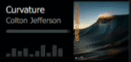
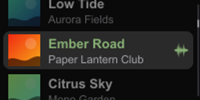
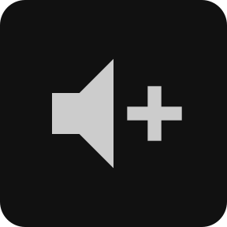
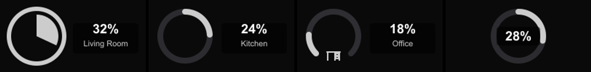
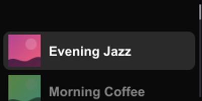
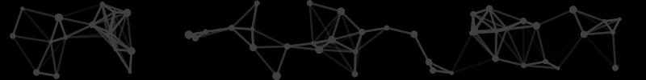

# Sonos Controller for Elgato Stream Deck

Full Sonos playback control for your Stream Deck — cover art, track info, volume dials, favorites browsing, and ambient panorama effects.

Available on the [Elgato Marketplace](https://marketplace.elgato.com/product/sonos-controller-083f868f-c0b5-43bc-8db5-ba287254fce5) (reviewed, stable) — or grab the [latest GitHub release](https://github.com/rocklobster42195/streamdeck-sonos-controller/releases/latest) for new features and beta builds first.

> **Disclaimer:** This is an independent, community-made plugin. It is not affiliated with, endorsed by, or officially connected to Sonos, Inc. or Elgato in any way. Sonos is a trademark of Sonos, Inc.

---

## At a Glance

| Key Actions | Dial Actions *(Stream Deck+ only)* |
|---|---|
| [**Play / Pause**](#play--pause) — cover art · scrolling title · progress | [**Track Control**](#track-control-stream-deck-only) — cover art · title · progress · EQ or Panorama |
| [**Playback Control**](#playback-control) — next · previous · shuffle · repeat | [**Queue**](#queue-stream-deck-only) — the queue as a scrolling list · jump to any track |
| [**Volume Control**](#volume-control) — up · down · mute · preset | [**Volume**](#volume-stream-deck-only) — pie, ring or open ring · mute · preset |
| [**Play Favorite**](#play-favorite) — one tap to play a saved favorite | [**Group Volume**](#group-volume-stream-deck-only) — control a whole Sonos group's volume together |
| [**Multi-Control**](#multi-control) — Line-In switching (optional fade) or a live Battery display | [**Favorites**](#favorites-stream-deck-only) — your favorites as a scrolling list · what is playing and where it comes from |
| | [**Panorama Effects**](#panorama-effects-stream-deck-only) — ambient art spanning a row of dials, also other plugins' |

---

## Actions

### Play / Pause

Toggles playback on your Sonos speaker. While playing, the key displays the current album or radio station cover art. A scrolling marquee shows track title and artist. Works correctly for a speaker that's grouped with others, following the group's actual playback rather than the joined speaker's own idle state.

| Setting | Description |
|---------|-------------|
| Device | Which Sonos speaker to control |
| Show device name | Display the speaker's zone name as the key title |
| Show cover art | Display album art on the key while playing |
| Progress bar | Thin bar at the bottom of the key showing track position, tinted to the cover's dominant color |
| Show track title | Scroll the track title and artist across the key |
| Font color | Color for the scrolling title text |
| Font size | Size of the title text (px) |
| Colour | `Grey` (as before), `Cover`, `Like Panorama` or `Fixed`: the play icon, and the progress bar instead of the cover's own colour |
| Battery | `Off`, `Warning` (icon only when the battery is low), or `Always` — mini battery icon for battery-powered speakers (Sonos Roam, Move). Only shown when the selected device actually reports battery data. |

---

### Track Control *(Stream Deck+ only)*

The LCD panel shows the album or station cover art, a scrolling track title, artist name, and a progress bar — tinted to match the cover art palette. If the selected speaker is grouped with others, it correctly reflects the whole group's playback (cover, title, play/pause state) rather than the joined speaker's own idle state.

Also handy for quickly auditioning a playlist: rotate to scrub within the current track, press to jump to the next one.

| Interaction | Effect |
|-------------|--------|
| Rotate | Seek ±5% in the current track |
| Press | Skip to next track |
| Touch | Toggle play / pause |

| Setting | Description |
|---------|-------------|
| Device | Which Sonos speaker to control |
| Look | Without an effect: `Track info` or `Equalizer` (animated bars) |
| Panorama | Whether this dial shows its row's effect — see [Panorama](#panorama-one-effect-per-row) |
| Battery | `Off`, `Warning` (icon only when the battery is low), or `Always` — mini battery icon in the corner for battery-powered speakers (Sonos Roam, Move). Only shown when the selected device actually reports battery data. |

---

### Playback Control

Next, previous, shuffle, or repeat — each as a dedicated key. All four **dim automatically** when a radio station is playing, since seek controls are unavailable for live streams.

**Seek:** hold Next or Previous to switch the key to seeking. Every tap then jumps forward (Next) or back (Previous) by the seek step; quick taps add up and go out as one jump, so six quick taps of 10 seconds jump a minute at once. The key shows the jump (`+1:00`) and otherwise where the track is. It switches back by itself after 3 seconds without a tap, or when you hold it again. Next and Previous act when you let go of the key.

 

| Setting | Description |
|---------|-------------|
| Device | Which Sonos speaker to control |
| Command | `Next Track`, `Previous Track`, `Toggle Shuffle`, or `Toggle Repeat` |
| Colour | `Grey` (as before), `Cover` (the colour of what the speaker plays), `Like Panorama` (the row colour of this Stream Deck) or `Fixed` (any colour) ; shuffle and repeat use it while on |
| Seek step | Next and Previous only: `5`, `10` (default), `15` or `30` seconds per tap while seeking |

---

### Queue *(Stream Deck+ only)*

The queue as a list that scrolls smoothly, one track per click of the dial, with the selected track in the middle. It rests on the track that is playing (green, with a small wave) and follows it when the next one starts. Push plays the selected track; touch, or a few seconds without input, glides back to the playing one. When the speaker doesn't play from its own queue — a radio station, or music another app streams to it (e.g. Music Assistant) — the dial shows only the row's Panorama effect.

| Interaction | Effect |
|-------------|--------|
| Rotate | Scroll through the queue (playback keeps running until you push) |
| Push | Play the selected track |
| Touch | Back to the playing track |

| Setting | Description |
|---------|-------------|
| Device | Which Sonos speaker to control |
| Show covers | Off: icons only |
| Back to the playing track after | Seconds without input (`0` = stays until touched) |
| Panorama | Whether this dial shows its row's effect |

---

### Volume Control

Increase, decrease, mute, or set a preset volume with a single key press.

| Setting | Description |
|---------|-------------|
| Device | Which Sonos speaker to control |
| Command | `Volume Up`, `Volume Down`, `Mute / Preset`, or `Volume Preset` |
| Colour | `Grey` (as before), `Cover` (the colour of what the speaker plays), `Like Panorama` (the row colour of this Stream Deck) or `Fixed` (any colour) ; muted stays grey |
| Preset Volume | Target volume for the preset command |
| Show preset | Display the preset value on the key |
| Show volume | Display the current volume level on the key after adjusting it (`Volume Up`/`Volume Down`/`Mute`, not shown for `Volume Preset`) |
| Volume as | *(Mute / Preset)* `Pie` (default), `Ring` or `Open ring` |

---

### Volume *(Stream Deck+ only)*

Dedicated volume control showing the current level as a pie (default), a ring or an open ring. When muted, a volume-off icon replaces it.

| Interaction | Effect |
|-------------|--------|
| Rotate | Adjust volume (±1% per tick, ±2% for fast rotation) |
| Press | Toggle mute |
| Touch | Set volume to configured preset |
| Long-touch | Save the current volume as the new preset |

| Setting | Description |
|---------|-------------|
| Device | Which Sonos speaker to control |
| Preset Volume | Target volume for touch |
| Volume as | `Pie`, `Ring` or `Open ring` |
| Icon | *(Ring, open ring)* An icon of your choice in the middle of the ring or in the open ring's opening, e.g. for the room |
| Show text | Show/hide the volume percentage and device name on the dial |
| Alignment | Position of the gauge: `Left`, `Center`, or `Right` |
| Panorama | Whether this dial shows its row's effect |

---

### Group Volume *(Stream Deck+ only)*

Controls the volume of an entire Sonos group — all speakers currently grouped together — instead of a single device. Rotating moves every group member by the same number of percentage points, so a speaker that's already louder than the others (e.g. a Sonos Port next to quieter satellites) keeps its relative balance instead of being flattened to match them. Automatically follows the group even if its membership or coordinator changes later.

| Interaction | Effect |
|-------------|--------|
| Rotate | Adjust the whole group's volume together |
| Press | Toggle mute for the entire group |
| Touch | Recall the saved per-speaker volume preset |
| Long-touch | Save each speaker's current volume as the preset |

| Setting | Description |
|---------|-------------|
| Group | Which Sonos group to control (selected by any of its member speakers) |
| Volume as | `Pie`, `Ring` or `Open ring` |
| Icon | *(Ring, open ring)* An icon of your choice in the middle of the ring or in the open ring's opening |
| Show text | Show/hide the volume percentage on the dial |
| Alignment | Position of the gauge: `Left`, `Center`, or `Right` |
| Panorama | Whether this dial shows its row's effect |

---

### Play Favorite

Play one of your saved Sonos favorites with a single key press. The key displays the favorite's cover art while it is playing.

With **Fade out** enabled, the currently playing music fades down smoothly across the whole group before the favorite starts, and every speaker returns to its own volume afterwards — switch playlists mid-evening without anyone noticing a hard cut.

| Setting | Description |
|---------|-------------|
| Device | Which Sonos speaker to control |
| Favorite | Select from your Sonos favorites list |
| Show title | Display the favorite's title on the key |
| Fade out | Fade the whole group out (2–8 s) before switching, then restore each speaker's own volume |

---

### Multi-Control

One key, pick a function per instance: switch a speaker to its **Line-In** input, or turn the whole key into a live **Battery** status display for portable speakers (Sonos Roam, Move).

With **Fade out** enabled on Line-In, the currently playing music fades down across the whole group before switching, and every speaker returns to its own volume right after. With **Battery** selected, the key shows the live level (color-coded green/orange/red) and charging status; pressing the key forces an immediate refresh instead of waiting for the next check.

| Setting | Description |
|---------|-------------|
| Device | Which Sonos speaker to control |
| Function | `Line-In` or `Battery` — Battery is only offered for devices that actually report battery data |
| Fade out | *(Line-In only)* Fade the whole group out (2–8 s) before switching, then restore each speaker's own volume |
| Colour | *(Line-In only)* `Grey` (as before), `Cover`, `Like Panorama` or `Fixed` for the Line-In icon |

---

### Favorites *(Stream Deck+ only)*

 

Browse and play your saved Sonos favorites. Rotate and the favorites become a list that scrolls smoothly, one entry per click of the dial, the selected one in the middle and the playing favorite in green with a small wave. When idle, the dial shows a card with what is playing and where it comes from: the favorite, or the playlist, album or station Sonos reports (e.g. "Playlist · Spotify"). When nothing is known about it — for example music Music Assistant streams to the speaker — it shows a heart, filled while playing. With a Panorama effect in the row, the card and the heart sit on top of it.

| Interaction | Effect |
|-------------|--------|
| Rotate | Scroll through favorites |
| Push | Play the selected favorite |
| Touch | Back to the card |

| Setting | Description |
|---------|-------------|
| Device | Which Sonos speaker to control |
| Show covers | Off: icons only |
| Line-In as the last entry | Add Line-In to the list — only offered when the selected speaker has a Line-In input |
| Back to "now playing" after | Seconds without input |
| Fade | Fade the whole group out (2–8 s) before switching, then restore each speaker's own volume |
| Heart position | Where the heart sits: `Left`, `Center`, or `Right` |
| Panorama | Whether this dial shows its row's effect |

---

### Panorama Effects *(Stream Deck+ only)*

Ambient visual effect animation that spans multiple adjacent LCD panels as one continuous scene. Place two or more side by side to connect them into a seamless panorama. Pick from several built-in effects, or see the [streamdeck-kit](https://github.com/rocklobster42195/streamdeck-kit) (where the effects live now) if you want to add your own.

**Particles**
A drifting network of glowing particles that connect with lines as they pass close to each other.

**Boing Ball**
The classic raytraced checkered ball, bouncing back and forth across the panels.

**Boing Globe**
A spinning raytraced Earth that drifts across the panels, wrapping seamlessly around the edge.

**Matrix Rain**
Cascading columns of code rain down the panels, Matrix-style.

| Interaction | Effect |
|-------------|--------|
| Rotate | Change the effect's value (particle density or speed, rain density, ball/globe speed) — for the whole row; a badge at the top shows which one and how far |
| Push | Switch which value turning changes |

| Setting | Description |
|---------|-------------|
| Device | The speaker whose track the text shows (or none) |
| Show track info | Title and artist across the Panorama Effects dials next to each other |
| Panorama | The row's effect, its dials and its settings (in "More settings …") |

### Panorama: one effect per row

All dials of a Stream Deck form a row with **one** effect and one set of settings. Choose it in any dial's Panorama section (short line in the panel, everything else in "More settings …"): the effect, which dials of the row show it (a tick per dial), its **colour** — **Cover** (the colour of what the active speaker plays, or of one chosen speaker), a **fixed** colour, or the effect's own — and its settings. A dial without a tick shows its normal view; the effect runs on behind it. Sonos Controller shares its speakers' cover colours with the other plugins, so a row of only other plugins' dials can follow the cover too. The row also spans the dials of other plugins that use it (see [Works with other plugins](#works-with-other-plugins-deckbus)): for example Music Assistant Controller's dials next to yours share the effect.

> **Note on background CPU usage:** an active effect renders continuously for as long as it's running — Stream Deck panels have no animation hardware of their own, so the plugin has to keep pushing a freshly-drawn frame for every tick. That's inherent to how the SDK works, not a bug. Expect a modest but constant background CPU cost while any Panorama Effects group is active (roughly 10–20% of one CPU core for a 4-panel group in our own testing, depending on the effect and your hardware) — it drops back to near zero once no group is running. Particles and Matrix Rain run at 10 fps; Boing Ball and Boing Globe run at 20 fps (their bounce motion needs the extra smoothness).

---

## Works with other plugins (deckbus)

SONOS Controller talks to other Stream Deck plugins on your computer through **deckbus**, a small open bus between plugins. You don't need to set anything up: when the plugins run, they find each other.

**Offers:** the Panorama: dials of SONOS Controller and of other plugins in the same row share one effect (for example Music Assistant Controller's dials next to yours). Its **speakers as players**: what each one plays (title, cover, position, volume), so other plugins' keys can show and control them, for example after you set up Music Assistant. Controlling them is on by default. Also where its actions are and whether it found Sonos speakers.

**Uses:** the Panorama of the other plugins' dials in the same row.

**Only with your permission:** nothing.

deckbus stays on your computer. It uses local pipes (Windows) or sockets (macOS), plugins must know a key stored in your user profile, and nothing goes over the network. The protocol is open: [deckbus protocol](https://github.com/rocklobster42195/streamdeck-kit/blob/main/docs/deckbus-protocol.md).

## Requirements

- **Elgato Stream Deck** — any model for key actions; **Stream Deck+** required for dial actions (developed and tested on the 4-dial Stream Deck+; hardware with more dials per row, e.g. a 6-dial Stream Deck+ XL, is untested)
- **Stream Deck software** — version 7.1 or later
- **Sonos system** — any Sonos speaker on the same local network as your computer
- **Network** — plugin and speaker should be on the same subnet; automatic discovery does not cross router or VLAN boundaries, though a manual IP fallback (see [Troubleshooting](#troubleshooting)) can work around this in most VLAN setups

---

## Setup

1. Download the latest `.streamDeckPlugin` file from the [Releases page](https://github.com/rocklobster42195/streamdeck-sonos-controller/releases/latest) and double-click it to install. *(Submitted to the Elgato Marketplace — pending review; this section will be updated with a direct install link once it's live there.)*
2. Drag an action from the **Sonos Controller** category onto a key or dial slot.
3. Open the action's settings (click the slot in Stream Deck software).
4. Select your **Sonos device** from the dropdown — devices are discovered automatically on your local network.
5. Configure the remaining options and click anywhere to save.

> The plugin supports **English**, **German**, and **Spanish** in the settings panel — the language follows your operating system's regional setting.

---

## Troubleshooting

**Speaker not showing in the device list**
- Make sure the speaker is powered on and connected to your Wi-Fi or Ethernet.
- The computer and speaker are normally expected to be on the **same subnet** — the plugin's automatic discovery uses UPnP/SSDP, which does not cross router or VLAN boundaries.
- Restart the Stream Deck software and wait a few seconds for discovery to complete.
- **On a separate VLAN?** Open any action's settings and expand **"Speaker not showing up?"** below the device dropdown, then enter the IP address of any *one* reachable speaker. This only needs to be done once, in a single spot — Sonos speakers share their whole household's topology with each other, so the rest of your system is then found automatically everywhere in the plugin. You'll still need to pick your device from the dropdown afterwards, as usual. This works as long as your router allows regular (unicast) traffic between the VLANs — only multicast discovery itself is blocked.

**Cover art not showing on radio stations**
- Radio station art is fetched on first play. It may take a moment to appear after the plugin starts.

**Controls not responding / out of sync**
- The plugin uses UPnP event subscriptions for real-time updates. On an unstable network, a subscription may drop and recover automatically within 60 seconds.
- If the problem persists, restart the Stream Deck software.

**All dials stop responding after the computer wakes from sleep**
- Windows sometimes reclassifies the network as "Public" after a sleep/wake cycle, which silently blocks the discovery traffic Sonos speakers use to announce themselves (SSDP), even though normal browsing/streaming still works fine.
- The plugin caches the last speaker it successfully found and retries through it directly (bypassing SSDP) on the next startup, so most of the time this now recovers on its own — no restart needed.
- If it doesn't recover: check Windows' network profile for your current connection (Settings → Network & Internet) and set it to **Private**, or reconnect once and confirm you're back on your usual network.

**Plugin using noticeable CPU in the background**
- Check whether a **Panorama Effects** group is active — see the [note above](#panorama-effects-stream-deck-only) on why continuous background rendering is inherent to animated effects, not a bug. CPU usage drops back down once no effect group is running.

**Panorama Effects not connecting across panels**
- All Panorama Effects dials must be placed in **adjacent slots** in the same profile row.
- Each dial detects its neighbors automatically — no manual column setting is needed.
- Development and testing so far has only been done on a **Stream Deck+** (4 dials). Behavior on hardware with more dials per row (e.g. a 6-dial Stream Deck XL) is untested — hardware needed.

---

## Network Notes

- The plugin subscribes to **UPnP events** from each Sonos device for real-time track and volume updates.
- Subscriptions are automatically renewed to maintain the connection.
- **No cloud connection** — the plugin only communicates with Sonos devices on your local network.
- **VLANs** — only the initial device *discovery* (SSDP, multicast) is blocked by VLAN boundaries; once one speaker is reachable, all actual control traffic is regular unicast HTTP and crosses VLANs fine as long as your router routes between them. See the manual IP fallback in [Troubleshooting](#troubleshooting).

---

## License

MIT — see [LICENSE](LICENSE)

---

## Credits

Built with:
- [Elgato Stream Deck SDK](https://developer.elgato.com/documentation/stream-deck/) (`@elgato/streamdeck`)
- [Sonos TypeScript SDK](https://github.com/svrooij/node-sonos-ts) (`@svrooij/sonos`) by Stephan van Rooij — MIT license
- [Material Design Icons](https://pictogrammers.com/library/mdi/) (`@mdi/js`) — MIT license
